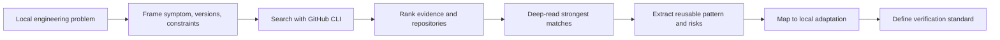

<!-- markdownlint-disable MD013 MD033 -->

<h1 align="center">GitHub Solution Research</h1>

<p align="center">
  A Codex skill for turning concrete engineering blockers into GitHub-backed evidence, repository comparisons, and local implementation plans.
</p>

<p align="center">
  <a href="#简体中文">简体中文</a>
  ·
  <a href="#english">English</a>
  ·
  <a href="#license">License</a>
</p>

<p align="center">
  
  
  
  
</p>

> **Status boundary / 状态边界**
>
> This repository packages a Codex skill for GitHub-backed engineering solution research. It uses GitHub CLI first, keeps subagent research conditional, and requires evidence-backed output. It is not an automatic fixer, not a vulnerability scanner, and not a guarantee that GitHub contains the answer.
>
> 本仓库打包的是一个用于 GitHub 证据研究的 Codex skill。新版流程以 GitHub CLI 为默认入口，子代理只在适合时条件触发，并要求输出可核验的证据闭环。它不是自动修复器，不是漏洞扫描器，也不保证 GitHub 一定有答案。

## 友链 / Community

本项目接受 LINUX DO 社区佬友监督与反馈：[LINUX DO](https://linux.do/)

## 简体中文

### 项目定位

GitHub Solution Research 是一个可独立安装的 Codex skill，用于把具体工程问题转化为有证据的 GitHub 开源研究流程：搜索公开仓库、issue、PR、discussion、代码、示例和 release notes，比较候选项目，再把可复用模式落到本地修复、实现方案或验证计划中。

它适合处理“这个问题别人是否已经在开源项目里解决过”的场景。它不适合替代本地调试、官方文档核对、代码审查或安全审计，也不应该被用来复制私有仓库、token、cookie、凭证、敏感日志、production data 或大段第三方代码。

### Features

| 能力 | 已包含内容 | 边界 |
| --- | --- | --- |
| GitHub CLI first | 默认使用 `gh search repos`、`gh search issues`、`gh search prs`、`gh search code`、`gh repo view`、`gh pr view`、`gh issue view` 和 `gh api` | 不再依赖仓库内置 Python 搜索脚本；`gh` 结果仍需深读和本地验证 |
| 问题证据搜索 | 围绕错误文本、包名、API 名、版本号、配置键、框架和失败命令搜索 issues、PRs、code、examples、release notes | 只把 GitHub 当证据来源，不把链接数量或 Stars 当成结论 |
| 仓库候选研究 | 按问题匹配、Stars、license、活跃度、示例质量和适配成本比较公开仓库 | Stars 是成熟度信号，不会覆盖 maintainer evidence、merged PR、official examples 或可复现代码 |
| 条件子代理研究 | 当问题跨多个生态、查询族或证据面时，可拆给子代理并行只读研究 | 子代理不是默认强制；controller 仍负责范围控制、去重、排序、本地适配和最终验证 |
| 输出证据闭环 | `SKILL.md` 要求记录 search path、subagent used/skipped、key evidence、rejected options、verification standard | 使用子代理时必须留下 subagent trace，避免“搜了很多”但没有可复核证据 |
| Codex 集成 | `agents/openai.yaml` 提供可识别的 skill 展示信息和默认 prompt | 仍需要用户在本机 Codex skill 目录中安装 |

### When to use

使用这个 skill：

- 构建、运行、测试、部署、SDK、API、依赖、框架或集成问题可能已有开源先例。
- 某个功能实现卡在 API 用法、边界条件、版本差异或配置形态上。
- 你需要比较多个 GitHub 项目，并说明 Stars、license、活跃度、适配成本和风险。
- 你需要从 issue、PR、release notes、示例代码或测试中提取可落地的修复模式。
- 你希望在写本地方案前先明确：可复用什么、必须适配什么、不能复制什么、如何验证。
- 一个研究任务横跨多个框架、语言、工具、部署面或 GitHub community，需要条件式并行研究。

不要使用它：

- 文案、小型本地重构、或代码库已经明确给出答案的改动。
- 用户明确禁止联网或 GitHub 研究的任务。
- 未获授权的私有仓库、凭证、cookie、token、公司内部代码、敏感日志、production data 或不可公开上下文。
- 需要直接修复生产事故但尚未完成本地日志、状态和官方文档核对的情况。
- 窄错误已经有唯一明显仓库、API 或 maintainer surface，且子代理只会重复同一批搜索。

### How it works



默认研究路径：

1. 先在本地定义问题：目标、症状、错误文本、版本、运行环境、约束和已尝试方案。
2. 选择证据面：错误和回归优先搜 issue/PR/release/code；能力选型优先搜仓库候选；实现卡点两者都用。
3. 判断是否需要子代理。只有当任务跨多个独立生态、查询族或证据面时才拆分；否则说明跳过原因。
4. 用 `gh` 和精确查询搜索公开 GitHub：错误文本、包名、API 名、版本号、配置键、框架和失败命令。
5. 按问题匹配度、证据强度、本地适用性、可操作性和项目成熟度排序。
6. 深读最强候选，提取可复用接口、配置、测试、工作流、风险和 license 边界。
7. 合并、去重并拒绝不适配候选；使用子代理时由 controller 直接核验关键 claim。
8. 输出本地修复或实施建议，并给出验证命令、真实请求、测试或人工检查标准。

### Installation

安装到默认 Codex skill 目录：

```bash
mkdir -p ~/.codex/skills
git clone https://github.com/Jia-Ethan/github-solution-research.git \
  ~/.codex/skills/github-solution-research
```

更新已有安装：

```bash
git -C ~/.codex/skills/github-solution-research pull --ff-only
```

建议先安装并登录 GitHub CLI：

```bash
gh auth status
```

这个 skill 不绑定任何具体模型。它吸收了多 agent 搜索建议，但保持模型无关；真正的约束在于问题拆分、证据链接、去重、controller 复核和本地验证。

### Usage examples

在 Codex 中调用 skill：

```text
Use $github-solution-research to investigate this Vite build error.
Find matching GitHub issues, merged PRs, release notes, and reusable fixes,
then recommend the smallest local adaptation and verification command.
```

搜索仓库候选：

```bash
gh search repos "browser automation agent" \
  --archived=false \
  --sort stars \
  --order desc \
  --limit 10 \
  --json fullName,url,description,stargazersCount,forksCount,language,license,pushedAt,isArchived,openIssuesCount
```

搜索某个仓库内的 issue：

```bash
gh search issues '"Cannot find module" "Node.js 22"' \
  --repo owner/repo \
  --sort updated \
  --order desc \
  --limit 10 \
  --json title,url,state,updatedAt,commentsCount,repository,body
```

搜索 merged PR：

```bash
gh search prs '"ERR_PACKAGE_PATH_NOT_EXPORTED" vite plugin' \
  --repo owner/repo \
  --merged \
  --sort updated \
  --order desc \
  --limit 10 \
  --json title,url,state,updatedAt,commentsCount,repository,body
```

查看仓库基本信息：

```bash
gh repo view owner/repo \
  --json nameWithOwner,url,description,stargazerCount,forkCount,licenseInfo,primaryLanguage,pushedAt,repositoryTopics,homepageUrl
```

### Subagent trace contract

如果使用子代理，最终回答需要留下这部分信息：

- scope：每个子代理负责的查询族、仓库范围、证据面和限制。
- evidence surfaces：实际搜索过的 repos、issues、PRs、discussions、code、examples、releases 或 docs。
- key findings：可复核的关键发现与直接链接。
- rejected candidates：拒绝项和拒绝原因。
- deduplication results：哪些结果其实是同一 repo、issue、PR、代码路径或重复报告。
- controller verified claims：controller 用 `gh`、源码读取、测试、日志、真实请求或官方文档直接核验过的 claim。

### Output contract

当这个 skill 实质影响结论时，回答应包含：

- 本地问题画像：目标、症状、版本、环境和约束。
- 搜索路径：查询词、搜索面、候选来源，以及是否使用或跳过子代理。
- 子代理 trace：仅在使用子代理时输出，包含 scope、evidence surfaces、key findings、rejected candidates、deduplication results、controller verified claims。
- 候选项目：repo、Stars、forks、语言、license、活跃度、基本内容、匹配理由和适配成本。
- 关键证据：issue、PR、代码、示例、release notes 或文档链接，以及为什么匹配。
- 推荐方案：直接复用什么、本地适配什么、避免复制什么。
- 风险和拒绝项：旧版本、不适配、license、隐私、安全或部署风险。
- 验证标准：测试、构建、复现命令、真实请求或人工检查。
- 置信度：证据弱或没有强匹配时必须明确说明。

### Security

- 默认只研究公开 GitHub 内容。私有仓库必须由用户明确授权并限定范围。
- 不要把 GitHub token、cookie、密码、API key、私有仓库内容、内部上下文、敏感日志、production data 或凭证写入 prompt、输出、日志、README、脚本或记忆文件。
- 不要把 token、cookie、私有仓库内容、敏感日志、secrets、production data 或凭证交给子代理。
- 只有在 `gh` 命令明确出现 403、429、私有仓库授权错误或未登录提示时，才需要检查 `gh auth status`。
- 避免复制大段第三方代码。优先复用公开 API、配置形态、工作流、测试模式和架构思路；如需代码复用，先检查 license 和归属要求。
- 对安全、支付、鉴权、基础设施或生产运维类问题，GitHub 证据必须与当前官方文档或官方仓库交叉验证。

### Status boundaries and roadmap

当前已包含：

- Codex skill 主入口：`SKILL.md`
- OpenAI agent metadata：`agents/openai.yaml`
- 研究评分和提取参考：`references/`
- GitHub CLI first 的查询模板和输出契约
- 条件式 subagent / parallel research guidance

可改进方向：

- 增加更结构化的 JSON schema 输出。
- 增加针对常见语言生态的查询模板。
- 增加离线示例夹具，方便在不访问 GitHub API 时演示输出格式。
- 增加 CI，检查 Markdown 链接、格式和敏感信息模式。

不会承诺：

- 自动修复本地代码。
- 自动判断所有 GitHub 结果真假。
- 保证每个工程问题都有公开答案。
- 在未授权范围内读取或复制私有代码。

### License

MIT License. See [LICENSE](LICENSE).

## English

### Project positioning

GitHub Solution Research is an independently installable Codex skill for turning concrete engineering problems into evidence-backed GitHub research. It searches public repositories, issues, PRs, discussions, code, examples, and release notes; compares candidate repositories; and maps reusable patterns into local fixes, implementation plans, or verification standards.

Use it when the real question is: "Has the open-source ecosystem already solved something close enough to this problem?" It does not replace local debugging, official documentation, code review, or security review. It must not be used to copy private repositories, tokens, cookies, credentials, sensitive logs, production data, or large chunks of third-party code.

### Features

| Capability | Included | Boundary |
| --- | --- | --- |
| GitHub CLI first | Uses `gh search repos`, `gh search issues`, `gh search prs`, `gh search code`, `gh repo view`, `gh pr view`, `gh issue view`, and `gh api` as the default inspection surface | No bundled Python search script is required; `gh` output still needs deep-reading and local verification |
| Problem evidence search | Searches issues, PRs, code, examples, release notes, and docs using exact errors, package/API names, versions, config keys, frameworks, and failing commands | GitHub is evidence, not proof by link count or popularity |
| Repository candidate research | Compares public repositories by problem fit, Stars, license, activity, example quality, and adaptation cost | Stars are maturity signals; they do not override maintainer evidence, merged PRs, official examples, or reproducible code |
| Conditional subagent research | Splits read-only research across subagents when a task spans multiple ecosystems, query families, or evidence surfaces | Subagents are not mandatory by default; the controller remains responsible for scope, deduplication, ranking, local adaptation, and final verification |
| Evidence-backed output | `SKILL.md` requires search path, subagent used/skipped, key evidence, rejected options, and verification standard | When subagents are used, the final answer must include a subagent trace |
| Codex integration | `agents/openai.yaml` provides skill-facing display metadata and a default prompt | Users still need to install it into their local Codex skills directory |

### When to use

Use this skill when:

- A build, runtime, test, deploy, SDK, API, dependency, framework, or integration blocker may have an open-source precedent.
- A feature is blocked by unclear API usage, edge cases, version behavior, or configuration shape.
- You need to compare GitHub projects by Stars, license, activity, fit, adaptation cost, and risk.
- You need to extract actionable patterns from issues, PRs, release notes, examples, or tests.
- You want a clear answer on what to reuse, what to adapt locally, what not to copy, and how to verify.
- A research task spans multiple frameworks, languages, tools, deployment surfaces, or GitHub communities and would benefit from conditional parallel research.

Do not use it for:

- Copy edits, tiny local refactors, or changes where the existing codebase already dictates the answer.
- Tasks where the user explicitly forbids network or GitHub research.
- Unauthorized private repositories, credentials, cookies, tokens, internal company code, sensitive logs, production data, or non-public context.
- Production incidents where local logs, runtime state, and official docs have not been checked first.
- Narrow errors with one obvious repository, API, or maintainer surface where subagents would duplicate the same search.

### How it works


Default research path:

1. Frame the local problem: goal, symptom, error text, versions, runtime, constraints, and attempted fixes.
2. Choose the evidence surface: issues, PRs, releases, and code for errors; repository candidates for reusable capabilities; both for implementation blockers.
3. Decide whether subagents are useful. Use them only when the task spans independent ecosystems, query families, or evidence surfaces; otherwise state why they were skipped.
4. Search public GitHub with `gh` and targeted queries: exact errors, package names, API names, versions, config keys, frameworks, and failing commands.
5. Rank by problem fit, evidence strength, local applicability, actionability, and project maturity.
6. Deep-read the strongest candidates and extract reusable interfaces, configuration, tests, workflows, risks, and license boundaries.
7. Merge, deduplicate, and reject weak candidates; when subagents were used, the controller directly verifies the strongest claims.
8. Produce a local fix or implementation recommendation with a concrete verification command, request, test, or manual check.

### Installation

Install into the default Codex skills directory:

```bash
mkdir -p ~/.codex/skills
git clone https://github.com/Jia-Ethan/github-solution-research.git \
  ~/.codex/skills/github-solution-research
```

Update an existing installation:

```bash
git -C ~/.codex/skills/github-solution-research pull --ff-only
```

Install and authenticate GitHub CLI when needed:

```bash
gh auth status
```

This skill is not tied to any specific model. It incorporates multi-agent search advice while staying model-agnostic; the durable contract is problem decomposition, linked evidence, deduplication, controller verification, and local validation.

### Usage examples

Invoke the skill in Codex:

```text
Use $github-solution-research to investigate this Vite build error.
Find matching GitHub issues, merged PRs, release notes, and reusable fixes,
then recommend the smallest local adaptation and verification command.
```

Search repository candidates:

```bash
gh search repos "browser automation agent" \
  --archived=false \
  --sort stars \
  --order desc \
  --limit 10 \
  --json fullName,url,description,stargazersCount,forksCount,language,license,pushedAt,isArchived,openIssuesCount
```

Search matching issues in one repository:

```bash
gh search issues '"Cannot find module" "Node.js 22"' \
  --repo owner/repo \
  --sort updated \
  --order desc \
  --limit 10 \
  --json title,url,state,updatedAt,commentsCount,repository,body
```

Search merged PRs:

```bash
gh search prs '"ERR_PACKAGE_PATH_NOT_EXPORTED" vite plugin' \
  --repo owner/repo \
  --merged \
  --sort updated \
  --order desc \
  --limit 10 \
  --json title,url,state,updatedAt,commentsCount,repository,body
```

Inspect repository basics:

```bash
gh repo view owner/repo \
  --json nameWithOwner,url,description,stargazerCount,forkCount,licenseInfo,primaryLanguage,pushedAt,repositoryTopics,homepageUrl
```

### Subagent trace contract

When subagents are used, the final answer should include:

- scope: each subagent's query family, repository scope, evidence surface, and constraints.
- evidence surfaces: repos, issues, PRs, discussions, code, examples, releases, or docs actually searched.
- key findings: directly linked findings that matter.
- rejected candidates: rejected options and reasons.
- deduplication results: results that point to the same repo, issue, PR, code path, or repeated report.
- controller verified claims: claims directly verified by the controller with `gh`, source reads, tests, logs, real requests, or official docs.

### Output contract

When this skill materially affects an answer, the answer should include:

- Local problem profile: goal, symptom, versions, environment, and constraints.
- Search path: queries, GitHub surfaces, discovery methods used, and whether subagents were used or skipped.
- Subagent trace: only when subagents were used; include scope, evidence surfaces, key findings, rejected candidates, deduplication results, and controller verified claims.
- Repository candidates: repo, Stars, forks, language, license, activity, basic content, fit rationale, and adaptation cost.
- Key evidence: links to issues, PRs, code, examples, release notes, or docs, with match rationale.
- Recommended solution: what to reuse directly, what to adapt locally, and what to avoid copying.
- Rejected or risky options: stale versions, mismatches, license, privacy, security, or deployment risks.
- Verification standard: test, build, reproduction command, real request, or manual check.
- Confidence label when evidence is weak or no strong GitHub solution was found.

### Security

- The default scope is public GitHub content. Private repositories require explicit user authorization and a bounded scope.
- Do not write GitHub tokens, cookies, passwords, API keys, private repository contents, internal context, sensitive logs, production data, or credentials into prompts, outputs, logs, READMEs, scripts, or memory files.
- Do not pass tokens, cookies, private repository contents, sensitive logs, secrets, production data, or credentials to subagents.
- Only check `gh auth status` when a `gh` command fails with 403, 429, a private repository authorization error, or an explicit not-authenticated message.
- Avoid copying large blocks of third-party code. Prefer public APIs, configuration shapes, workflows, test patterns, and architecture ideas. If code reuse is necessary, check the license and attribution obligations first.
- For security, payments, auth, infrastructure, or production operations, cross-check GitHub findings against current official docs or official repositories.

### Status boundaries and roadmap

Currently included:

- Codex skill entrypoint: `SKILL.md`
- OpenAI agent metadata: `agents/openai.yaml`
- Research rubric and extraction references: `references/`
- GitHub CLI first query templates and output contract
- Conditional subagent / parallel research guidance

Possible improvements:

- Add a structured JSON schema for research outputs.
- Add query templates for common language ecosystems.
- Add offline sample fixtures for demonstrating output shape without GitHub API access.
- Add CI for Markdown links, formatting, and sensitive-content pattern checks.

This project does not promise to:

- Automatically fix local code.
- Automatically judge every GitHub result as true or false.
- Guarantee a public answer for every engineering problem.
- Read or copy private code outside the user's authorized scope.

### License

MIT License. See [LICENSE](LICENSE).
