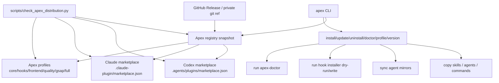

# ApexPowers 安装与分发顶级化路线图

本文回答一个问题：ApexPowers 现在已经有脚本和 plugin manifest，但安装与分发大约只有 5/10；要做到顶级项目那种 one-command、marketplace、profile 化分发，还缺什么，应该怎么做。

## 结论

ApexPowers 不应该把 hook 偷偷塞进 plugin manifest，也不应该一开始就追求“大而全 marketplace”。正确升级方向是四层分离：

1. `apex` CLI：统一 `install`、`update`、`uninstall`、`doctor`、`profile`、`version`。
2. Release artifact：以 GitHub Release zip/tar、checksum、installer script 作为权威分发包。
3. Marketplace / registry：让 Codex / Claude Code 能发现和安装 ApexPowers plugin。
4. Profile：按场景选择安装 core、hooks、frontend、quality、gsap、full，而不是复制一整包。

短期推荐：先做 Python CLI 包，支持 `pipx install` / `uv tool install` 私有 Git 源安装；同时新增 Codex / Claude marketplace catalog 和 Apex profile registry。中期再补 GitHub Releases、PowerShell / shell installer、checksum、release channel。公开 marketplace 或 Homebrew / npm 入口放到后期。

## 调研方式和证据边界

本轮使用了三类证据：

- 本地源码：`README.md`、`.codex-plugin/plugin.json`、`.claude-plugin/plugin.json`、`commands/*.toml`、`scripts/check_apex_distribution.py`、`apex-init-project-hooks`、`apex-doctor`、benchmark 和测试。
- GrokSearch：成功返回 Homebrew 官方文档证据；较宽查询和部分 fetch 因 provider timeout / 401 / provider error 没有可验证 sources，因此不把失败结果当成证据。
- 官方文档补证：OpenAI Codex plugins、Claude Code plugins / marketplaces、uv、pipx、MCP Registry。

并行子智能体也做了只读研究：

- CLI 分发研究：比较 `uv`、`pipx`、Homebrew、Rustup、npm / npx、Deno 的 one-command、upgrade、uninstall、doctor 模式。
- Marketplace / profile 研究：比较 Codex plugins、Claude Code plugin marketplaces、Anthropic 官方插件目录、OpenAI Apps SDK、MCP Registry。

## 外部成熟模式

| 项目 / 平台 | 顶级分发做法 | 对 ApexPowers 的启发 |
| --- | --- | --- |
| OpenAI Codex Plugins | plugin 通过 marketplace catalog 暴露；repo marketplace 可放在 `$REPO_ROOT/.agents/plugins/marketplace.json`；CLI 支持 `codex plugin marketplace add/list/upgrade/remove`；安装后缓存到 `~/.codex/plugins/cache/...`；plugin 可启停；bundled hooks 仍需要用户 trust review。参考：[Codex Build plugins](https://developers.openai.com/codex/plugins/build)、[Codex Plugins](https://developers.openai.com/codex/plugins)。 | ApexPowers 应提供 repo marketplace，并让 Codex 通过 marketplace 安装 plugin；hook 仍保留 installer / trust 边界。 |
| Claude Code Plugins | marketplace 是 catalog；`.claude-plugin/marketplace.json` 描述 marketplace、owner、plugins 和 source；plugin 可包含 skills、agents、hooks、MCP servers。参考：[Claude plugin marketplaces](https://code.claude.com/docs/en/plugin-marketplaces)、[Claude plugins](https://code.claude.com/docs/en/plugins)。 | ApexPowers 应补 Claude marketplace 文件，而不只是一份 `.claude-plugin/plugin.json`。 |
| uv / uvx | 提供官方 shell / PowerShell standalone installer，也支持 PyPI、pipx、brew、winget、scoop；standalone 安装可 `uv self update`；非 standalone 安装使用对应包管理器升级。参考：[uv installation](https://docs.astral.sh/uv/getting-started/installation/)。 | ApexPowers 可短期用 `uv tool install` / `uvx` 运行私有 Git 包；长期可有自己的 installer 和 self-update，但不能越过 host config trust。 |
| pipx | CLI app 装进隔离环境；支持 install、run、list、upgrade、uninstall；普通用户权限运行，干净卸载。参考：[pipx](https://pipx.pypa.io/)。 | ApexPowers 现在以 Python 脚本为主，`pipx install git+ssh://...` 是最务实的一键安装路径。 |
| Homebrew | tap / formula 是分发元数据；`brew install/upgrade/uninstall/doctor` 生命周期清晰；formula 要有 test / audit。参考：[Formula Cookbook](https://docs.brew.sh/Formula-Cookbook)、[Tap docs](https://docs.brew.sh/How-to-Create-and-Maintain-a-Tap)、[Manpage](https://docs.brew.sh/Manpage)。 | 后期可以做 `xiamulo/homebrew-apexpowers`，但私有仓库认证和 formula 维护成本较高，不适合作为第一阶段。 |
| MCP Registry | registry 是集中 metadata repository，不托管所有代码；它描述 server 名称、包位置、执行方式和能力。当前仍是 preview。参考：[MCP Registry](https://modelcontextprotocol.io/registry/about)、[registry repo](https://github.com/modelcontextprotocol/registry)。 | ApexPowers 的 registry 也应先做“元数据和引用”，不要把所有安装逻辑散落在 README。 |

## 当前 ApexPowers 状态

已有资产：

| 能力 | 当前文件 | 评价 |
| --- | --- | --- |
| Codex plugin manifest | `.codex-plugin/plugin.json` | 已有 thin manifest，声明 skills 和 UI 元数据，不声明 hooks。方向正确。 |
| Claude plugin manifest | `.claude-plugin/plugin.json` | 已有 skills / commands 指针，但没有 marketplace catalog。 |
| Hook installer | `.codex/skills/apex-init-project-hooks/scripts/init_project_hooks.py` | 已有 dry-run、write、update、uninstall、manifest ownership、hash、Codex / Claude host config merge。很强，但它只是 hook 安装器，不是完整发行层。 |
| Health check | `.codex/skills/apex-doctor/scripts/apex_doctor.py` | 已有目标项目只读检查。应成为 `apex doctor` 的底层实现。 |
| Distribution checker | `scripts/check_apex_distribution.py` | 能检查分发文件漂移，但还不知道 profile / marketplace / release artifact。 |
| Commands | `commands/*.toml` | 有 host prompt wrapper，不是用户级一键安装命令。 |
| Benchmark | `benchmarks/apex_distribution_benchmark.py` | 已覆盖分发检查、doctor、installer dry-run、route render；适合扩展到 CLI smoke。 |

明显缺口：

- 没有 `pyproject.toml` / `setup.py` / `package.json`，所以没有标准包入口。
- 没有 `apex` 命令，用户只能记多条 Python 脚本路径。
- 没有 repo marketplace：缺 `$REPO_ROOT/.agents/plugins/marketplace.json` 和 `.claude-plugin/marketplace.json`。
- 没有 profile：无法只装 core、只装 hooks、只装 frontend、只装 quality、只装 gsap。
- 没有 release channel：缺 `stable`、`canary`、`local-dev`、`private`。
- 没有 artifact manifest：缺 release zip/tar、SHA256SUMS、版本文件、构建来源、文件清单。
- 没有 registry / profile validator：checker 不能检查 profile 引用不存在、路径越界、重复 skill 名、hook 权限声明缺失、license/source 缺失。
- README 仍包含较多复制命令和技能清单，容易和源码漂移。

## 目标架构



核心原则：

- Marketplace 负责发现，不负责静默改用户配置。
- Profile 负责选择安装范围，不负责绕过 host trust。
- CLI 负责 one-command 和生命周期，不复制已有 hook / doctor 逻辑。
- Release artifact 是权威版本源，README 只是入口说明。
- Hook 继续由 `apex-init-project-hooks` 安装，并且默认先 dry-run。

## 推荐新增文件

第一阶段建议新增这些文件：

```text
pyproject.toml
src/apexpowers_cli/__init__.py
src/apexpowers_cli/__main__.py
src/apexpowers_cli/commands.py
src/apexpowers_cli/profiles.py
src/apexpowers_cli/registry.py
src/apexpowers_cli/paths.py
.agents/plugins/marketplace.json
.claude-plugin/marketplace.json
registry/apexpowers.registry.json
registry/profiles/core.json
registry/profiles/hooks.json
registry/profiles/frontend.json
registry/profiles/quality.json
registry/profiles/gsap.json
registry/profiles/full.json
scripts/build_release_artifact.py
docs/apexpowers-install-distribution-roadmap.md
tests/test_apex_cli.py
tests/test_apex_registry.py
```

如果要保持更轻，可以先不拆多个 profile JSON，先用一个 `registry/apexpowers.registry.json` 承载全部 profile，等 schema 稳定后再拆。

## 推荐 CLI 设计

命令形状：

```powershell
apex version
apex profile list
apex profile show core
apex install <target> --profile core --dry-run
apex install <target> --profile full --write
apex update <target> --profile full --dry-run
apex uninstall <target> --profile hooks --dry-run
apex doctor <target> --json
apex sync-agents <target> --write
apex hooks install <target> --dry-run
apex hooks install <target> --write
apex hooks uninstall <target> --dry-run
```

实现边界：

- `apex doctor` 调用现有 `apex_doctor.py`。
- `apex hooks install/update/uninstall` 调用现有 `init_project_hooks.py`。
- `apex sync-agents` 调用现有 `sync_agent_mirrors.py`。
- `apex install` 只做 profile 编排：复制对应 skill / agent / command，必要时调用 sync / hooks dry-run。
- 所有会写文件的命令默认 dry-run，必须显式 `--write`。
- `--json` 输出稳定结构，方便 CI、benchmark 和后续 marketplace validator 调用。

短期安装入口：

```powershell
pipx install "git+ssh://git@github.com/xiamulo/ApexPowers.git"
apex install D:\gitdown\SomeProject --profile core --write
apex doctor D:\gitdown\SomeProject --json
```

或：

```powershell
uv tool install "git+ssh://git@github.com/xiamulo/ApexPowers.git"
apex install D:\gitdown\SomeProject --profile core --write
```

长期安装入口：

```powershell
powershell -ExecutionPolicy Bypass -c "irm https://github.com/xiamulo/ApexPowers/releases/latest/download/install.ps1 | iex"
apex install D:\gitdown\SomeProject --profile full --write
```

安全提示：README 里必须同时提供“先下载查看脚本，再执行”的方式：

```powershell
irm https://github.com/xiamulo/ApexPowers/releases/latest/download/install.ps1 -OutFile install-apexpowers.ps1
Get-Content .\install-apexpowers.ps1
powershell -ExecutionPolicy Bypass -File .\install-apexpowers.ps1
```

## 推荐 Profile 设计

最小 schema：

```json
{
  "schemaVersion": "apexpowers.profile.v1",
  "name": "core",
  "description": "Apex project/session init, doctor, agent mirrors.",
  "skills": [
    "apex-session-init-codex",
    "apex-init-project-agent",
    "apex-sync-agent-mirrors",
    "apex-doctor"
  ],
  "claudeSkills": [
    "apex-session-init-claude-code"
  ],
  "agents": [
    "researcher",
    "planner",
    "developer",
    "implementer",
    "code-reviewer"
  ],
  "commands": [
    "apex-doctor",
    "apex-sync-agent-mirrors"
  ],
  "hooks": false
}
```

推荐 profile：

| Profile | 包含内容 | 适用场景 |
| --- | --- | --- |
| `core` | Apex 自有初始化、doctor、agent mirrors、核心 agents。 | 大多数项目默认先装这个。 |
| `hooks` | `apex-init-project-hooks`、doctor、hook command wrapper。 | 明确需要 loop guardrail 的项目。 |
| `frontend` | `frontend-design`、`webapp-testing`、`next-best-practices`、`vercel-react-best-practices`、`web-design-guidelines`。 | 前端 / Next / React 项目。 |
| `quality` | `web-quality-audit`、`accessibility`、`performance`、`core-web-vitals`、`seo`、`best-practices`、`apex-lean-review`。 | 质量审计和生产化检查。 |
| `gsap` | 8 个 `gsap-*` skills。 | 动画项目或需要 GSAP 专家规则时。 |
| `full` | `core` + `hooks` + `frontend` + `quality` + `gsap` + planning/PRD/issue skills。 | 私有主力项目或完整工作流试点。 |

hook profile 必须显式声明：

```json
{
  "hooks": {
    "installer": "apex-init-project-hooks",
    "defaultMode": "dry-run",
    "requiresTrust": true,
    "writesHostConfig": true,
    "managedByManifest": true
  }
}
```

## 推荐 Registry / Marketplace 设计

Apex 自有 registry：

```json
{
  "schemaVersion": "apexpowers.registry.v1",
  "name": "apexpowers",
  "owner": {
    "name": "xiamulo",
    "url": "https://github.com/xiamulo"
  },
  "channels": {
    "stable": {
      "ref": "v0.1.0"
    },
    "canary": {
      "ref": "main"
    },
    "local-dev": {
      "ref": "working-tree"
    }
  },
  "plugin": {
    "name": "apexpowers",
    "version": "0.1.0",
    "source": {
      "type": "github",
      "repo": "xiamulo/ApexPowers",
      "ref": "v0.1.0"
    },
    "manifests": {
      "codex": ".codex-plugin/plugin.json",
      "claude": ".claude-plugin/plugin.json"
    }
  },
  "profiles": [
    "core",
    "hooks",
    "frontend",
    "quality",
    "gsap",
    "full"
  ]
}
```

Codex repo marketplace：

```json
{
  "name": "apexpowers-local",
  "interface": {
    "displayName": "ApexPowers"
  },
  "plugins": [
    {
      "name": "apexpowers",
      "source": {
        "source": "local",
        "path": "./"
      },
      "policy": {
        "installation": "AVAILABLE",
        "authentication": "ON_INSTALL"
      },
      "category": "Developer Tools"
    }
  ]
}
```

Claude marketplace：

```json
{
  "name": "apexpowers",
  "owner": {
    "name": "xiamulo",
    "url": "https://github.com/xiamulo"
  },
  "plugins": [
    {
      "name": "apexpowers",
      "source": {
        "type": "git",
        "url": "https://github.com/xiamulo/ApexPowers",
        "ref": "v0.1.0"
      }
    }
  ]
}
```

注意：Codex 官方文档要求 marketplace `source.path` 相对 marketplace root，并且保持在 root 内。若 ApexPowers 将 `.agents/plugins/marketplace.json` 放在本仓库，`path` 指向 `./` 是最简单的本地测试方式。发布到独立 marketplace repo 时再改为 git-subdir 或 release source。

## 发布通道

| Channel | Source | 用途 | 风险控制 |
| --- | --- | --- | --- |
| `local-dev` | working tree | 本机调试和开发。 | 只用于当前仓库；不推荐给其他项目。 |
| `canary` | `main` 或 prerelease tag | 给自己或小范围项目试用最新能力。 | `apex doctor` 必须提示 canary；hook install 默认 dry-run。 |
| `stable` | semver tag，例如 `v0.1.0` | 默认推荐安装。 | release artifact、checksum、distribution check、benchmark smoke 必须通过。 |
| `private` | private git ref / private release | 私有完整版。 | 认证说明不写 token；支持 SSH 和 GitHub credential manager。 |
| `community` | public subset | 后续公开发行。 | 去掉私有规则、敏感默认 prompt、内部 workflow。 |

## Release Artifact 设计

每个 release 至少包含：

```text
ApexPowers-v0.1.0.zip
ApexPowers-v0.1.0.tar.gz
SHA256SUMS
install.ps1
install.sh
registry/apexpowers.registry.json
.agents/plugins/marketplace.json
.claude-plugin/marketplace.json
```

artifact manifest：

```json
{
  "schemaVersion": "apexpowers.artifact.v1",
  "version": "0.1.0",
  "gitRef": "v0.1.0",
  "createdAt": "2026-06-20T00:00:00Z",
  "files": {
    "ApexPowers-v0.1.0.zip": {
      "sha256": "..."
    },
    "install.ps1": {
      "sha256": "..."
    }
  },
  "profiles": [
    "core",
    "hooks",
    "frontend",
    "quality",
    "gsap",
    "full"
  ]
}
```

## Checker / Doctor 扩展

`scripts/check_apex_distribution.py` 应新增检查：

- `pyproject.toml` 存在，且 console script 暴露 `apex`。
- Codex marketplace JSON schema 合法。
- Claude marketplace JSON schema 合法。
- registry schema 合法。
- 每个 profile 引用的 skill / agent / command 都存在。
- profile 不允许路径逃逸。
- `hooks` profile 必须声明 `requiresTrust: true`、`managedByManifest: true`。
- vendored skills 必须记录来源或 license 边界。
- plugin manifest version 与 registry version 一致。
- release artifact manifest 中列出的文件存在，checksum 可复算。
- README 的安装命令来自 CLI / registry，不再手写重复清单。

`apex doctor` 应新增检查：

- 当前 `apex` CLI 版本。
- 安装来源：pipx / uv tool / release / local-dev。
- 安装 profile。
- Codex plugin 是否 installed / enabled。
- Claude plugin 是否 installed。
- hook 是否只由 Apex-managed manifest 管理。
- host config 是否有用户未信任 hook。
- marketplace source 是否可刷新。
- profile 与实际文件是否漂移。

## 实施路线

### Phase 1：本地 one-command CLI

- [ ] 新增 `pyproject.toml`。
- [ ] 新增 `src/apexpowers_cli/`。
- [ ] 暴露 `apex` console script。
- [ ] `apex doctor` 调用现有 doctor。
- [ ] `apex hooks install/update/uninstall` 调用现有 hook installer。
- [ ] `apex sync-agents` 调用现有 mirror sync。
- [ ] `apex profile list/show` 读取 registry。
- [ ] 测试：`python -m unittest tests.test_apex_cli`。

验收：在本仓库能运行 `python -m apexpowers_cli version` 或 `apex version`，并且 `apex doctor . --json` 与现有 doctor 输出一致或兼容。

### Phase 2：Profile / registry

- [ ] 新增 `registry/apexpowers.registry.json`。
- [ ] 定义 `core`、`hooks`、`frontend`、`quality`、`gsap`、`full` profile。
- [ ] `apex install <target> --profile core --dry-run` 输出将复制 / 跳过 / 写入的完整计划。
- [ ] `apex install <target> --profile hooks --write` 只调用 hook installer，不直接写 hooks。
- [ ] 扩展 distribution checker 校验 profile 引用。

验收：profile 中任一 skill / agent / command 改名都会让 checker fail。

### Phase 3：Marketplace

- [ ] 新增 `.agents/plugins/marketplace.json`。
- [ ] 新增 `.claude-plugin/marketplace.json`。
- [ ] 扩展 checker 校验 marketplace schema、source path、policy、category、owner。
- [ ] README 增加 Codex marketplace 安装方式。
- [ ] README 增加 Claude marketplace 安装方式。

验收：Codex 能从 repo marketplace 看到 ApexPowers；Claude Code 能 add marketplace 并 browse / install ApexPowers。hook 仍需 trust review。

### Phase 4：Release artifact

- [ ] 新增 `scripts/build_release_artifact.py`。
- [ ] 生成 zip / tar.gz / SHA256SUMS / artifact manifest。
- [ ] `install.ps1` 和 `install.sh` 只负责下载、校验、调用 `apex install`。
- [ ] benchmark 增加 release artifact smoke。
- [ ] CI 或本地 release checklist 写入 README / docs。

验收：全新机器只需下载 release artifact，校验 checksum 后能装 `apex`，再对目标项目执行 `apex install --profile core --write`。

### Phase 5：发布渠道

- [ ] `stable` channel 指向 semver tag。
- [ ] `canary` channel 指向 main。
- [ ] 私有 GitHub Release 支持 GitHub credential manager / SSH。
- [ ] 评估是否发布 `pipx` / PyPI 包名。
- [ ] 评估是否创建 Homebrew tap。
- [ ] 公开 profile 脱敏后再考虑 Codex / Claude 公共 marketplace。

验收：README 第一屏只保留 2-3 个推荐入口，详细复制安装清单从 README 移到 generated profile / registry。

## 不建议做的事

- 不要把 hook 安装隐藏在 plugin manifest 里。Codex 官方文档也明确 plugin-bundled hooks 仍需要用户 review / trust；ApexPowers 还额外涉及 host config merge 和 ownership manifest。
- 不要一开始做 npm-only。当前代码主要是 Python 脚本，npm 只会增加 Node shim 和 Windows PATH 复杂度。
- 不要把 marketplace 当成代码仓库。它应该是 catalog / metadata，代码仍来自 git ref、release artifact 或本地 plugin folder。
- 不要直接公开完整私有 profile。应先区分 private / community profile。
- 不要让 `apex update` 无提示改用户 shell profile 或 host config。所有写入仍需 dry-run 和 `--write`。

## 目标评分

| 维度 | 当前 | Phase 3 后 | Phase 5 后 |
| --- | ---: | ---: | ---: |
| one-command install | 4/10 | 7/10 | 9/10 |
| update / uninstall | 7/10 | 8/10 | 9/10 |
| marketplace | 2/10 | 8/10 | 9/10 |
| profile 化 | 1/10 | 8/10 | 9/10 |
| private 分发 | 6/10 | 8/10 | 9/10 |
| public/community 分发 | 1/10 | 4/10 | 8/10 |
| verification gates | 7/10 | 8/10 | 9/10 |

阶段性目标：先把安装与分发从 5/10 拉到 8/10。达到 8/10 的定义是：

- 有 `apex` CLI。
- 有 profile registry。
- 有 Codex / Claude marketplace catalog。
- checker 能验证 profile / marketplace。
- README 不再要求用户手动复制大量文件。
- hook 安装仍保持 dry-run、manifest ownership 和 trust review。

9/10 以后才需要追求：release artifact、checksum、installer scripts、stable / canary channels、公开 marketplace / Homebrew / PyPI。
