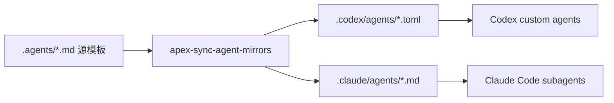
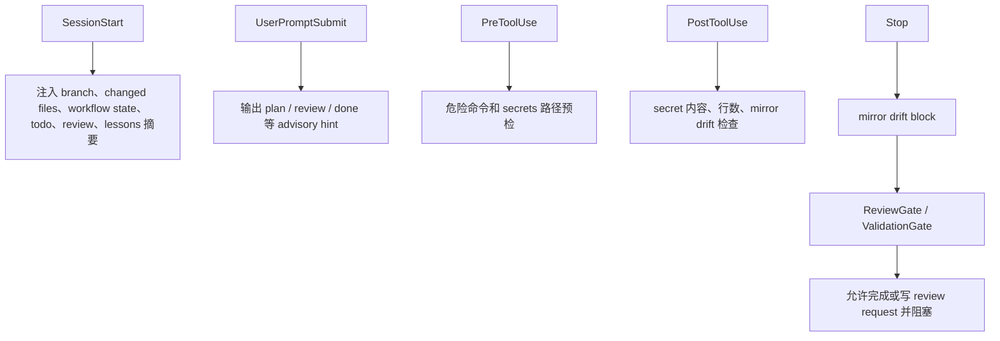

# ApexPowers 源码阅读总览：Skills、子智能体、目标、流程与 Hooks

本文基于当前仓库源码、脚本、测试、profile manifest、plugin manifest、commands 和既有文档整理。它回答六个问题：

- 这个项目有哪些 skill。
- 这个项目有哪些子智能体。
- 当前 profile / plugin 分发边界是什么。
- ApexPowers 想实现什么目标。
- ApexPowers 从安装到日常运行的流程是什么。
- 每个 skill 和 hook 应该在什么场景使用。

## 一句话结论

ApexPowers 不是传统 Web app 或后台服务，而是一套私有的 Codex / Claude Code 工作流分发包。它把项目初始化规则、profile 化技能包、子智能体模板、Codex / Claude agent 镜像、manifest 管理的 loop hooks、健康检查、供应链漂移检查、并行交付协议和前端/动画/质量类 vendored skills 打包到一个仓库里，目标是在不同项目中快速复制一套可验证、可维护、可回滚、可按 profile 最小化安装的 agent 协作工作流。

## 项目目标

当前源码呈现出三层目标。

第一层是项目初始化：

- 为目标项目生成根规则入口：`AGENTS.md`、`CLAUDE.md`、`.claude/rules/*.md`。
- 为源码补齐标准头部说明：`@purpose`、`@deps`、`@exports`、`@location`、`@rules`。
- 为目录补齐轻量 `Agents.md`，让 agent 进入任意目录时能快速知道职责边界。

第二层是 agent 协作：

- 用 `.agents/*.md` 作为唯一源模板维护 6 个子智能体角色。
- 用 `apex-sync-agent-mirrors` 生成 Codex 官方 `.codex/agents/*.toml` 和 Claude Code 官方 `.claude/agents/*.md` 镜像。
- 通过 planner / implementer / developer / reviewer / researcher / perf-optimizer 把规划、实现、审查、调研、性能分析拆开。

第三层是生产化 guardrail：

- 用 `apex-init-project-hooks` 安装 Codex / Claude Code loop hooks。
- 用 hook runtime 在 `SessionStart`、`UserPromptSubmit`、`PreToolUse`、`PostToolUse`、`Stop` 等生命周期点做确定性检查。
- 用 `apex-doctor` 检查目标项目安装健康状态。
- 用 `scripts/check_apex_distribution.py` 检查 ApexPowers 仓库自身的分发文件是否漂移。
- 用 thin plugin manifests、command wrappers、跨宿主可移植性文档、platform-native 清单和 benchmark harness 支撑后续扩展。

第四层是安装与分发收敛：

- 用 `registry/apexpowers-profiles.json` 作为 profile manifest，把 31 个 Codex skills 分成 `core`、`hooks`、`planning`、`research`、`frontend`、`quality`、`gsap`、`full`。
- `.codex-plugin/plugin.json` 默认只指向 `.codex-plugin/profiles/core/skills/`，不再直接暴露全量 `.codex/skills/`。
- `.codex-plugin/profiles/core/skills/*` 是 wrapper；真实 skill 源仍然在 `.codex/skills/*/SKILL.md`。
- `docs/supply-chain-manifest.sha256` 记录 trust-critical 文件 hash；`docs/supply-chain-trust-security.md` 记录 hook trust、无遥测、NOTICE 和 false-positive 策略。
- `docs/apex-parallel-delivery-orchestration.md` 与 `commands/apex-orchestrate-delivery.toml` 把 worktree / issue / PR 级并行交付变成显式协议。

## Source Of Truth

| 能力 | 当前事实源 | 说明 |
| --- | --- | --- |
| Codex canonical skills | `.codex/skills/*/SKILL.md` | Codex 侧真实 skill 源。当前实际存在 31 个 Codex skill。 |
| Codex 默认 plugin skills | `.codex-plugin/profiles/core/skills/*/SKILL.md` | 默认 plugin 暴露面，只包含 core profile 的 6 个 wrapper skills，避免一次暴露 31 个 skills。 |
| Profile manifest | `registry/apexpowers-profiles.json` | 当前安装/分发 profile 的机器可读事实源；`full` 覆盖 31 个 Codex skills，`core` 是默认最小包。 |
| Claude skills | `.claude/skills/*/SKILL.md` | 当前只有 Claude Code 专属 session init skill。 |
| 子智能体源模板 | `.agents/*.md` | 这是唯一手写维护源。不要把它误认为官方运行时自动加载路径。 |
| Codex agent 镜像 | `.codex/agents/*.toml` | 由 `.agents` 生成，带 generated marker，不应手改。 |
| Claude agent 镜像 | `.claude/agents/*.md` | 由 `.agents` 生成，带 generated marker，不应手改。 |
| Hook route registry | `.codex/skills/apex-init-project-hooks/scripts/apex_loop_routes.py` | hook 事件、route id、matcher、command 的唯一事实源。 |
| Hook runtime | `.codex/skills/apex-init-project-hooks/scripts/apex_loop*.py` | 安装器复制这些 runtime 文件到 Codex / Claude agent root。 |
| Hook installer | `.codex/skills/apex-init-project-hooks/scripts/init_project_hooks.py` | dry-run、install、update、uninstall、manifest ownership 都在这里。 |
| Hook 参考模板 | `.codex/skills/apex-init-project-hooks/templates/*.json` | Codex / Claude hook 结构的参考模板；实际安装以 route registry 渲染和 host config merge 为准。 |
| Workflow 状态 | `tasks/loops/workflow.md`、`tasks/loops/<slug>/state.json` | agent loop 的可读状态块和机器状态。 |
| Review 状态 | `tasks/reviews/<slug>.md` | Stop hook 生成的审查请求和 review / validation 合约。 |
| 目标项目健康检查 | `.codex/skills/apex-doctor/scripts/apex_doctor.py` | 面向“已安装 ApexPowers 的目标项目”。 |
| ApexPowers 分发检查 | `scripts/check_apex_distribution.py` | 面向“ApexPowers 源仓库自身”。不要和 doctor 混用。 |
| 命令包装 | `commands/*.toml` | 给 command-capable host 的 prompt wrapper，不是第二套实现。 |
| 并行交付协议 | `docs/apex-parallel-delivery-orchestration.md`、`commands/apex-orchestrate-delivery.toml` | worktree / issue / PR 级并行交付的显式编排协议。 |
| 供应链与 trust | `docs/supply-chain-trust-security.md`、`docs/supply-chain-manifest.sha256`、`NOTICE.md` | 记录 vendored skills 来源、hook trust、无遥测、hash 漂移和公开分发前置条件。 |
| 分发与可移植性文档 | `docs/apex-agent-portability.md`、`docs/platform-native-solutions.md`、`docs/apexpowers-inventory.md`、`docs/apexpowers-install-distribution-roadmap.md` | 描述跨宿主边界、平台原生替代、安装分发路线和项目资产清单。 |
| 计划和研究记录 | `tasks/todo+*.md`、`tasks/reviews/*.md`、`tasks/research+*.md`、`docs/ecc-hook-comparison-plan.md`、`docs/apexpowers-shortcomings-assessment.md` | 记录已做计划、review 请求、外部方案比较、缺点评估和 hook 对齐计划。 |
| Benchmark | `benchmarks/apex_distribution_benchmark.py`、`benchmarks/README.md` | 离线验证分发、doctor、installer dry-run 和 route render 的确定性。 |

## 当前 Skills 清单

### Apex 自有 Codex Skills

| Skill | 路径 | 什么时候用 | 实际行为边界 |
| --- | --- | --- | --- |
| `apex-session-init-codex` | `.codex/skills/apex-session-init-codex/SKILL.md` | Codex 会话刚开始、或用户要求开工初始化时。 | 先读目标项目 `AGENTS.md`，有 `CLAUDE.md` 时也读，确认规则后继续当前任务。 |
| `apex-init-project-agent` | `.codex/skills/apex-init-project-agent/SKILL.md` | 要给已有项目初始化根协作规则时。 | 脚本只写固定 `AGENTS.md` / `CLAUDE.md` 骨架并列出 `.claude/rules` 目标；rules 正文必须由 agent 读真实源码后生成。 |
| `apex-init-project-code` | `.codex/skills/apex-init-project-code/SKILL.md` | 要扫描并补齐源码文件头部注释时。 | `init_code_headers.py` 只发现候选文件，不负责生成注释内容。 |
| `apex-init-project-file` | `.codex/skills/apex-init-project-file/SKILL.md` | 要补齐目录级 `Agents.md` 时。 | `init_agents_md.py` 只列候选目录；每个目录说明由 agent 根据真实上下文写，且应保持极简。 |
| `apex-sync-agent-mirrors` | `.codex/skills/apex-sync-agent-mirrors/SKILL.md` | 修改 `.agents/*.md` 后，或需要生成官方 Codex / Claude 子智能体镜像时。 | `.agents` 是唯一源；生成 `.codex/agents/*.toml` 和 `.claude/agents/*.md`。已有非生成文件默认跳过。 |
| `apex-init-project-hooks` | `.codex/skills/apex-init-project-hooks/SKILL.md` | 要为目标项目安装 Codex / Claude Code loop hooks 时。 | 默认 dry-run；`--write` 才安装。默认把 host config/runtime 写入 agent root，项目内只放 loop 状态。 |
| `apex-doctor` | `.codex/skills/apex-doctor/SKILL.md` | 安装后验收、排查 hooks / agent mirrors / workflow state 时。 | 只读检查目标项目，不修改文件；不要用它替代 ApexPowers 源仓库分发检查。 |
| `apex-lean-review` | `.codex/skills/apex-lean-review/SKILL.md` | 用户要求过度工程审查、依赖审查、YAGNI audit、想知道什么可以删时。 | 只审 over-engineering，不替代 correctness / security / maintainability review。 |
| `apex-grill-with-docs` | `.codex/skills/apex-grill-with-docs/SKILL.md` | 需求不清，且用户需要被系统性“烤问”以形成上下文时。 | 第一个问题先确认用户最多愿意回答多少个澄清问题；维护 `CONTEXT.md` 和 ADR。 |
| `apex-to-prd` | `.codex/skills/apex-to-prd/SKILL.md` | 已经烤清楚后，要把上下文合成为正式 PRD 时。 | 不继续访谈用户，直接综合已有上下文、术语和架构决定。 |
| `apex-to-issues` | `.codex/skills/apex-to-issues/SKILL.md` | PRD / spec / plan 就绪后，要拆成可独立实现的 vertical-slice issues 时。 | 按依赖顺序拆 issue，强调可验证、可发布、可交给 agent 执行。 |

### Claude Code 专属 Skill

| Skill | 路径 | 什么时候用 | 实际行为边界 |
| --- | --- | --- | --- |
| `apex-session-init-claude-code` | `.claude/skills/apex-session-init-claude-code/SKILL.md` | Claude Code 会话开始，或用户要求 apex session init 时。 | 先读 `CLAUDE.md`，再读 `AGENTS.md`，确认规则后继续任务。 |

### Vendored Web / Frontend / Research Skills

这些不是 Apex 自己的 workflow 核心，但被仓库 vendored，目标是让目标项目离线复制后也能直接使用。

| Skill | 路径 | 什么时候用 |
| --- | --- | --- |
| `frontend-design` | `.codex/skills/frontend-design/SKILL.md` | 构建或打磨 Web UI、页面、组件、dashboard、landing page 等视觉体验时。 |
| `webapp-testing` | `.codex/skills/webapp-testing/SKILL.md` | 用 Playwright 验证本地 Web app、截图、查看 console、定位元素时。 |
| `web-design-guidelines` | `.codex/skills/web-design-guidelines/SKILL.md` | 审查 UI、UX、accessibility、Web interface guidelines 时。 |
| `next-best-practices` | `.codex/skills/next-best-practices/SKILL.md` | 写或审 Next.js App Router、RSC、metadata、route handlers、image/font、bundling 等代码时。该 skill 标记为 `user-invocable: false`，更适合作为自动适用规则。 |
| `vercel-react-best-practices` | `.codex/skills/react-best-practices/SKILL.md` | 写、审、重构 React / Next.js 性能敏感代码时。 |
| `github-solution-research` | `.codex/skills/github-solution-research/SKILL.md` | 具体工程问题可能已有 GitHub repo / issue / PR / discussion 解法时。 |
| `accessibility` | `.codex/skills/accessibility/SKILL.md` | WCAG 2.2、a11y audit、screen reader、键盘导航、无障碍修复时。 |
| `best-practices` | `.codex/skills/best-practices/SKILL.md` | Web 安全、兼容性、代码质量、现代化检查时。 |
| `core-web-vitals` | `.codex/skills/core-web-vitals/SKILL.md` | LCP、INP、CLS、页面体验优化时。 |
| `performance` | `.codex/skills/performance/SKILL.md` | 页面加载和运行时性能优化、慢加载、page speed audit 时。 |
| `seo` | `.codex/skills/seo/SKILL.md` | SEO、meta tags、structured data、sitemap、搜索可见性时。 |
| `web-quality-audit` | `.codex/skills/web-quality-audit/SKILL.md` | 需要综合审计 performance、accessibility、SEO、best practices 时。 |

### GSAP Skills

| Skill | 路径 | 什么时候用 |
| --- | --- | --- |
| `gsap-core` | `.codex/skills/gsap-core/SKILL.md` | 基础 tween、easing、stagger、matchMedia、DOM/SVG 动画时。 |
| `gsap-scrolltrigger` | `.codex/skills/gsap-scrolltrigger/SKILL.md` | scroll animation、pinning、scrub、parallax、ScrollTrigger 时。 |
| `gsap-performance` | `.codex/skills/gsap-performance/SKILL.md` | 优化动画 FPS、减少 jank、避免 layout thrash 时。 |
| `gsap-timeline` | `.codex/skills/gsap-timeline/SKILL.md` | 多步骤动画编排、timeline、position parameter 时。 |
| `gsap-plugins` | `.codex/skills/gsap-plugins/SKILL.md` | ScrollTo、Flip、Draggable、SplitText、SVG、physics 等 GSAP 插件时。 |
| `gsap-utils` | `.codex/skills/gsap-utils/SKILL.md` | `gsap.utils` 的 clamp、mapRange、random、snap、toArray、wrap 等 helper 时。 |
| `gsap-react` | `.codex/skills/gsap-react/SKILL.md` | React / Next.js 里用 `useGSAP`、refs、context、cleanup 时。 |
| `gsap-frameworks` | `.codex/skills/gsap-frameworks/SKILL.md` | Vue、Nuxt、Svelte、SvelteKit 等非 React 框架里使用 GSAP 时。 |

## Profile 分发清单

`registry/apexpowers-profiles.json` 是当前 profile manifest。它不替代 `.codex/skills/*/SKILL.md` 的源码地位，而是定义“安装/暴露哪些能力”的分发表。

| Profile | 包含能力 | 什么时候用 | Hook 边界 |
| --- | --- | --- | --- |
| `core` | 6 个 Codex core wrappers、1 个 Claude session skill、5 个核心 agents、`apex-doctor` / `apex-sync-agent-mirrors` commands。 | 默认安装、默认 Codex plugin 暴露面、新项目最小接入。 | `hooks: false`。 |
| `hooks` | `apex-init-project-hooks`、`apex-doctor` 和对应 commands。 | 明确要启用 loop guardrail 时。 | 必须 `dry-run` 起步，声明 `requiresTrust: true`、`managedByManifest: true`。 |
| `planning` | `apex-grill-with-docs`、`apex-to-prd`、`apex-to-issues`，并带 `apex-orchestrate-delivery` command。 | 需求澄清、PRD、issue 拆分和并行交付编排。 | `hooks: false`。 |
| `research` | `github-solution-research` 和 `researcher` agent。 | 需要 GitHub / 外部证据调研时。 | `hooks: false`。 |
| `frontend` | `frontend-design`、`webapp-testing`、`web-design-guidelines`、`next-best-practices`、`react-best-practices`。 | 前端、React / Next、UI/UX 验证。 | `hooks: false`。 |
| `quality` | `web-quality-audit`、`accessibility`、`performance`、`core-web-vitals`、`seo`、`best-practices`、`apex-lean-review`。 | Web 质量、SEO、性能、可访问性和精简审查。 | `hooks: false`。 |
| `gsap` | 8 个 `gsap-*` skills。 | 动画项目或 GSAP 专项工作。 | `hooks: false`。 |
| `full` | `core`、`hooks`、`planning`、`research`、`frontend`、`quality`、`gsap` 的并集，并额外包含 `perf-optimizer`。 | 私有主力项目完整安装。 | 同 `hooks`，必须显式 trust。 |

当前默认 Codex plugin 暴露面：

| 文件 | 当前事实 |
| --- | --- |
| `.codex-plugin/plugin.json` | `skills` 指向 `./.codex-plugin/profiles/core/skills/`。 |
| `.codex-plugin/profiles/core/skills/*/SKILL.md` | 只是 wrapper，要求读取 canonical `.codex/skills/<skill>/SKILL.md`。 |
| `.codex/skills/*/SKILL.md` | 31 个 Codex skills 的真实内容源。 |
| `registry/apexpowers-profiles.json` | `full` 必须覆盖当前 31 个 Codex skills；distribution checker 会校验。 |

这解决了旧版本的膨胀问题：仓库仍保留 31 个 skills，但默认 plugin 不再一次性暴露全部能力。后续 `apex install --profile ...` 或 release packager 应以这个 manifest 为事实源。

## 子智能体清单

当前有 6 个源模板，全部在 `.agents/*.md`。`.codex/agents/*.toml` 和 `.claude/agents/*.md` 是由 `sync_agent_mirrors.py` 生成的镜像。

| Agent | 源模板 | Codex 镜像 | Claude 镜像 | 职责 | 适用场景 | 不适用场景 |
| --- | --- | --- | --- | --- | --- | --- |
| `planner` | `.agents/planner.md` | `.codex/agents/planner.toml` | `.claude/agents/planner.md` | 把非平凡任务拆成可执行、可验证计划，输出或更新 `tasks/todo+任务名.md`。 | 超过 3 步、跨模块、架构/验收不清、用户要求先给方案。 | 直接编码、审查已有 diff、已有明确计划等待执行。 |
| `implementer` | `.agents/implementer.md` | `.codex/agents/implementer.toml` | `.claude/agents/implementer.md` | 精确执行 planner 计划，不重新规划。 | 已有批准计划、task slug、步骤、文件范围、验证要求。 | 需求模糊、缺少计划、需要重新设计、需要外部调研或审查。 |
| `developer` | `.agents/developer.md` | `.codex/agents/developer.toml` | `.claude/agents/developer.md` | 小到中等规模端到端开发，可做小范围规划、编码、测试验证。 | 明确 bug 修复、小功能实现、按 reviewer 反馈修正。 | 纯调研、纯审查、超过 3 步复杂规划、已有细粒度计划应交给 implementer。 |
| `code-reviewer` | `.agents/code-reviewer.md` | `.codex/agents/code-reviewer.toml` | `.claude/agents/code-reviewer.md` | 只读审查质量、安全、可维护性、性能、规则一致性。 | 实现完成后、提交前、用户要求 review/audit、验证失败后判断风险。 | 直接修复、规划未开始任务、纯外部资料调研。 |
| `perf-optimizer` | `.agents/perf-optimizer.md` | `.codex/agents/perf-optimizer.toml` | `.claude/agents/perf-optimizer.md` | 性能瓶颈分析，给可执行优化方案。 | 卡顿、慢、内存高、主线程阻塞、React 重渲染、Canvas/WebGL、大数组/大图处理。 | 普通代码审查、纯 UI 文案、需求规划、无性能症状的泛泛优化。 |
| `researcher` | `.agents/researcher.md` | `.codex/agents/researcher.toml` | `.claude/agents/researcher.md` | 代码、文档、库、外部资料调研，只输出事实结论。 | 实现前核验源码/调用链/API/版本/兼容性/开源实践。 | 直接编码、执行已批准计划、审查已有 diff。 |

### 子智能体同步流程



同步规则：

- 调整角色职责、触发条件、工具边界时，先改 `.agents/*.md`。
- 然后运行 `apex-sync-agent-mirrors` 或脚本：

```powershell
python .codex\skills\apex-sync-agent-mirrors\scripts\sync_agent_mirrors.py . --target all --write
```

- 不要手写维护 `.codex/agents/*.toml` 或 `.claude/agents/*.md`。
- hook runtime 的 `MirrorDriftGuard` 会检查 `.agents/*.md` 改了但两个镜像没同步的情况。

## 项目运行流程

### 1. 仓库拉取

ApexPowers 是私有仓库。新机器先登录 GitHub，再 clone 到本地，例如 `D:\gitdown\ApexPowers`。

### 2. 选择 profile 和安装面

当前分发不再默认把 31 个 Codex skills 全部暴露给 Codex plugin。先选择 profile：

| 安装意图 | 推荐 profile |
| --- | --- |
| 新项目最小接入 | `core` |
| 只加 hook 门禁 | `hooks` |
| 需求/PRD/issue/并行交付 | `planning` |
| 前端项目 | `frontend` |
| 质量审计项目 | `quality` |
| GSAP 动画项目 | `gsap` |
| 私有完整工作流 | `full` |

现状边界：

- `registry/apexpowers-profiles.json` 已经提供机器可读 profile。
- `.codex-plugin/plugin.json` 默认只暴露 `core` wrapper skills。
- 还没有完整 `apex install --profile ...` CLI；在 CLI 落地前，人工复制/打包应按 profile manifest 选文件，而不是无条件复制所有 skills。

单个目标项目的完整私有安装仍可以复制全量：

- 复制 `.codex/skills/*` 到目标项目 `.codex/skills/`。
- 复制 `.claude/skills/apex-session-init-claude-code` 到目标项目 `.claude/skills/`。
- 复制 `.agents/*.md` 到目标项目 `.agents/`。

默认 core plugin 暴露面：

- Codex plugin 只读取 `.codex-plugin/profiles/core/skills/*`。
- wrapper skills 再要求读取 `.codex/skills/<skill>/SKILL.md` canonical source。

本机全局安装：

- Codex skills 可按 profile 复制到 `$env:USERPROFILE\.codex\skills`。
- Claude Code session init skill 复制到 `$env:USERPROFILE\.claude\skills`。

### 3. 初始化目标项目规则

常用顺序：

```powershell
python .codex\skills\apex-init-project-agent\scripts\init_project_agent.py <target>
python .codex\skills\apex-init-project-agent\scripts\init_project_agent.py <target> --write
```

然后由 agent 继续读取真实源码，补齐 `.claude/rules/*.md`。不要把脚本当成规则正文生成器。

### 4. 初始化代码头和目录说明

```powershell
python .codex\skills\apex-init-project-code\scripts\init_code_headers.py <target>
python .codex\skills\apex-init-project-file\scripts\init_agents_md.py <target> --dry-run
```

这两类脚本主要列候选清单。真正注释和 `Agents.md` 内容必须基于真实代码生成。

### 5. 生成子智能体镜像

```powershell
python .codex\skills\apex-sync-agent-mirrors\scripts\sync_agent_mirrors.py <target> --target all --write
```

生成后目标项目会同时拥有：

- `.agents/*.md` 源模板。
- `.codex/agents/*.toml` Codex custom agents。
- `.claude/agents/*.md` Claude Code subagents。

### 6. 安装 loop hooks

先 dry-run：

```powershell
python .codex\skills\apex-init-project-hooks\scripts\init_project_hooks.py <target> --json
```

确认后写入：

```powershell
python .codex\skills\apex-init-project-hooks\scripts\init_project_hooks.py <target> --write
```

默认布局：

- Codex host config：`<codex-home>/config.toml` 中的 Apex managed TOML block。
- Codex runtime：`<codex-home>/hooks/apex_loop*.py`。
- Claude host config：`<claude-home>/settings.json`。
- Claude runtime：`<claude-home>/hooks/apex_loop*.py`。
- 目标项目状态：`tasks/loops/`、`tasks/loops/workflow.md`、`tasks/reviews/`、`tasks/lessons.md`。
- Ownership manifests：`tasks/loops/.apex-manifest.json`、`<codex-home>/apex/manifest.json`、`<claude-home>/apex/manifest.json`。

安装后仍需要在 host 的 hook trust / review UI 中确认新 hook。plugin manifest 不会也不应该绕过这个信任流程。

维护模式：

```powershell
python .codex\skills\apex-init-project-hooks\scripts\init_project_hooks.py <target> --update --write
python .codex\skills\apex-init-project-hooks\scripts\init_project_hooks.py <target> --uninstall --write
```

兼容和安全开关：

- `--hook-scope agent` 是默认模式，把 host config/runtime 放到 Codex / Claude agent root。
- `--hook-scope project` 是 legacy 项目内 hook 布局，只在需要兼容旧项目时使用。
- `--codex-config-format auto` 会在 agent scope 使用 `config.toml`，在 legacy project scope 使用 `hooks.json`。
- `--codex-config-format json` 只用于旧式 Codex hook JSON 兼容场景。
- `--force` / `--regenerate` 会覆盖既有 generated 文件和手写 hook 文件，只应在确认 ownership 和备份后使用。
- `--uninstall` 只移除 manifest 记录的 Apex-managed 文件；如果文件内容已被用户改过，installer 会保守保留，避免误删手写配置。

### 7. 日常 agent 工作流



### 8. 健康检查和维护

目标项目安装健康：

```powershell
python .codex\skills\apex-doctor\scripts\apex_doctor.py <target> --json
```

`apex-doctor` 的重点是核心 Apex 安装面：Apex 自有 skills、agent mirrors、manifest / host config / runtime、workflow state 和 git 状态。它不是“所有 31 个 vendored Codex skills 是否齐全”的全量分发检查。

ApexPowers 源仓库分发一致性：

```powershell
python scripts\check_apex_distribution.py --json
```

当前分发检查覆盖 14 类门禁：

- required artifacts
- Codex / Claude thin plugin manifests
- profile manifest
- command wrappers
- portability doc
- parallel delivery orchestration
- platform-native doc
- lean-review skill
- benchmark method
- supply-chain / trust security doc
- NOTICE
- supply-chain SHA-256 manifest
- README / inventory metadata

修改 hook runtime / installer 后：

```powershell
python -m unittest tests.test_apex_loop_hooks tests.test_apex_loop_installer
```

修改分发层、plugin manifest、commands、benchmark 或跨宿主文档后：

```powershell
python scripts\check_apex_distribution.py --json
python -m unittest tests.test_apex_distribution
python benchmarks\apex_distribution_benchmark.py --runs 1 --json
```

如果 trust-critical 文件发生变化，先 review diff，再更新 hash manifest：

```powershell
python scripts\check_apex_distribution.py --write-sha256-manifest
python scripts\check_apex_distribution.py --json
```

## Hook 应该在什么地方用

### 使用位置

| 位置 | 是否应该使用 Apex hook | 原因 |
| --- | --- | --- |
| 目标项目的 Codex 会话 | 应该，在需要 guardrail 时安装。 | Codex 可通过 host config 调用 `apex_loop.py`，在工具使用和 Stop 时做检查。 |
| 目标项目的 Claude Code 会话 | 应该，在需要 guardrail 时安装。 | Claude Code 通过 `settings.json` 加载 hook。 |
| ApexPowers plugin manifest | 不应该直接声明 hooks。 | manifest 是薄声明层；hook 安装必须走 installer 和 trust review。 |
| Git pre-commit / CI | 不替代。 | Apex hook 是 agent 协作即时 guardrail，最终提交仍以 lint / type-check / test / CI 为准。 |
| 公开项目或客户项目 | 谨慎。 | 可优先全局安装，或把 `.codex/skills/apex-*`、`.claude/skills/apex-*`、`.agents/`、agent mirrors 加入 `.gitignore`。 |

### Hook 路由和职责

| Hook 事件 | Route | 触发时机 | 主要职责 | 阻塞策略 |
| --- | --- | --- | --- | --- |
| `SessionStart` | `default` | 新会话开始 | 注入 branch、changed files、workflow state、active todo、unresolved reviews、recent lessons。 | 不阻塞。 |
| `UserPromptSubmit` | `default` | 用户提交 prompt 后 | 输出 workflow-state block 和 plan / review / done advisory hint。 | 不阻塞。 |
| `PreToolUse` | `safety` | Bash/Shell/PowerShell/Edit/Write/MultiEdit/apply_patch 前 | 拦截危险命令、破坏性 git、远程脚本管道执行、secret-like 路径。 | 高风险阻塞。 |
| `PostToolUse` | `edit` | 写文件类工具后 | 检查写入内容是否含 secret，检查有效行数，提醒 mirror drift。 | secret 和硬行数阈值可阻塞；mirror drift 默认 warn。 |
| `PostToolUse` | `bash` | shell 工具后 | 对变更文件做同类检查。 | 同上。 |
| `PostToolUse` | `always` | post hook 兜底 | 没有工具路径时回退到 git changed files。 | 同上。 |
| `Stop` | `default` | agent 准备结束 turn 时 | 阻塞未同步 agent mirrors、未 review 的代码 diff、Ready review 后缺少 validation、review 已过期等情况。 | 可阻塞完成。 |

runtime 还提供手动命令：

- `check-line-length`
- `check-agent-mirrors`
- `render-config`
- `task-completed`，当前等价走 `stop` dispatcher。

### Hook Guards

| Guard | 所在脚本 | 检查什么 | 什么时候触发 |
| --- | --- | --- | --- |
| `SecurityGuard` | `apex_loop_runtime.py` | `rm -rf /`、`git reset --hard`、`git checkout --`、force push、`curl|bash`、`iex`、`eval` 等。 | `PreToolUse`。 |
| `SecretPathGuard` | `apex_loop_runtime.py` | `.env`、`.npmrc`、SSH key、credential、token、secret、private-key 等路径。 | `PreToolUse`。 |
| `SecretContentGuard` | `apex_loop_runtime.py` | 写入内容中疑似 private key、OpenAI key、GitHub PAT、AWS key、Slack token 等。 | `PostToolUse`。 |
| `LineLengthGuard` | `apex_loop_runtime.py` + `apex_loop_utils.py` | 支持的源码文件有效代码行数；warning 400，hard 500，generated/vendor/fixture 等例外。 | `PostToolUse` 或手动 `check-line-length`。 |
| `MirrorDriftGuard` | `apex_loop_runtime.py` | `.agents/*.md` 变化但 `.codex/agents/*.toml` / `.claude/agents/*.md` 未一起变化。 | `PostToolUse` warn，`Stop` block。 |
| `ReviewGate` | `apex_loop_runtime.py` + `apex_loop_utils.py` | 有 code diff 和 active todo 时，要求 `tasks/reviews/<slug>.md` review Ready。 | `Stop`。 |
| `ValidationGate` | `ReviewGate` 内部 | review Ready 但缺少 `Validation: Pass` 或 validation failed。 | `Stop`。 |
| workflow-state 推导 | `apex_loop_utils.py` | 根据 todo、diff、review、validation、state.json 推导 `no_task`、`planning`、`review_required`、`validation_required`、`done` 等。 | `SessionStart` 和 `UserPromptSubmit`。 |

## Workflow 状态文件和 Review 合约

Hook 不是只看当前 prompt，它还会读取目标项目里的任务状态文件。关键文件如下：

| 文件 | 谁写入 | 谁读取 | 用途 |
| --- | --- | --- | --- |
| `tasks/todo+<slug>.md` | planner / 用户 / agent | hook runtime、agent | 当前任务计划和 checklist。 |
| `tasks/loops/workflow.md` | installer 初始化，用户可编辑 | `SessionStart`、`UserPromptSubmit` | 按 `[apex-state:<state>]...[/apex-state:<state>]` 注入不同阶段的提示块。 |
| `tasks/loops/<slug>/state.json` | hook runtime | hook runtime、doctor | 记录 active slug、todo path、changed files、review status、attempts、review path、run id、updated_at。 |
| `tasks/reviews/<slug>.md` | Stop hook 生成，reviewer / agent 后续更新 | Stop hook、doctor、agent | 审查请求、scope、required reviewer、completion contract。 |
| `tasks/loops/failures.jsonl` 或 `tasks/loops/<slug>/failures.jsonl` | hook runtime | agent / 用户排障 | 结构化记录 guard 失败，便于复盘而不是只看终端输出。 |
| `tasks/lessons.md` | 用户 / agent | `SessionStart` | 最近经验教训摘要来源。 |

主要 workflow state：

| State | 含义 | 下一步 |
| --- | --- | --- |
| `no_task` | 没有 active todo 或可推导任务。 | 先规划或明确任务。 |
| `planning` | 有任务入口但实现尚未开始或上下文仍在规划。 | 让 planner / 当前 agent 完成可验证计划。 |
| `implementing` | 有 active todo 且已有实现迹象。 | 继续按 checklist 做小步改动并运行验证。 |
| `review_required` | 有代码 diff 和 active todo，但 review 未 Ready。 | 调用 `code-reviewer`，更新 `tasks/reviews/<slug>.md`。 |
| `validation_required` | review Ready，但还没有验证通过记录。 | 运行约定测试，把结果写入 review 文件。 |
| `done` | review 和 validation 都满足当前 hook 合约。 | 可以结束当前任务或进入提交流程。 |

Review 文件的完成合约是硬边界：

- 审查通过后必须把 `> **Status**: Pending` 改成 `> **Status**: Ready`。
- 验证通过后必须记录 `> **Validation**: Pass`。
- 如果 review 文件里仍有 Critical、Warning、blocker、P0、P1 等未解决问题，Stop hook 会继续阻止完成。
- 如果 review Ready 之后又产生新的代码 diff，Stop hook 会把旧 review 判定为 stale，要求重新审查。

## 每个 Skill 应该放在流程的哪里

| 阶段 | 应用 skill | 典型触发语义 |
| --- | --- | --- |
| 开工读规则 | `apex-session-init-codex` / `apex-session-init-claude-code` | “开始做这个项目”“先读规则”“apex-session-init”。 |
| 新项目接入 ApexPowers | `apex-init-project-agent` | “初始化 AGENTS.md / CLAUDE.md / rules”。 |
| 补源码头注释 | `apex-init-project-code` | “扫描代码文件头部注释”“补 @purpose”。 |
| 补目录说明 | `apex-init-project-file` | “给目录生成 Agents.md”。 |
| 维护子智能体 | `apex-sync-agent-mirrors` | “刷新/生成 Codex 和 Claude 子智能体镜像”。 |
| 安装 guardrail | `apex-init-project-hooks` | “安装 loop hooks”“给项目启用 hook 门禁”。 |
| 安装后排障 | `apex-doctor` | “检查 ApexPowers 安装健康”“hooks 不生效”“agent mirror 是否漂移”。 |
| 精简审查 | `apex-lean-review` | “有没有过度工程”“哪些依赖/抽象可以删”。 |
| 需求澄清 | `apex-grill-with-docs` | “先烤问需求”“帮我把需求问清楚”。 |
| PRD 合成 | `apex-to-prd` | “把已讨论内容整理成 PRD”。 |
| Issue 拆分 | `apex-to-issues` | “把 PRD/spec 拆成 issues”。 |
| 前端设计实现 | `frontend-design` | “做一个页面/组件/网站/仪表盘”“美化 UI”。 |
| 前端运行验证 | `webapp-testing` | “用 Playwright 测一下”“截图验证本地页面”。 |
| UI/UX 审查 | `web-design-guidelines`、`accessibility`、`web-quality-audit` | “审查 UI”“a11y audit”“综合质量审计”。 |
| React / Next 开发 | `vercel-react-best-practices`、`next-best-practices` | “写 React/Next”“优化 RSC/data fetching/bundle”。 |
| 性能 / SEO | `performance`、`core-web-vitals`、`seo` | “慢”“LCP/INP/CLS”“SEO”。 |
| 动画 | `gsap-*` | “GSAP”“ScrollTrigger”“timeline”“useGSAP”“Vue/Svelte 动画”。 |
| 外部解法调研 | `github-solution-research` | “GitHub 上有没有类似方案”“这个错误开源项目怎么解决”。 |

## Plugin 和 Commands 的位置

### Plugin manifests

| 文件 | 作用 |
| --- | --- |
| `.codex-plugin/plugin.json` | Codex 薄 plugin manifest，指向 `./.codex-plugin/profiles/core/skills/`，默认只暴露 core wrapper skills，不安装 hook。 |
| `.claude-plugin/plugin.json` | Claude Code 薄 plugin manifest，指向 `./.claude/skills/` 和 `./commands/`，不安装 hook。 |
| `registry/apexpowers-profiles.json` | ApexPowers 自有 profile manifest，定义 core / hooks / planning / research / frontend / quality / gsap / full。 |
| `.codex-plugin/profiles/core/skills/*` | Codex core profile wrapper skills，不是 canonical skill 源。 |

生产规则：

- manifest 只声明 skills / commands / metadata。
- 不在 manifest 里声明 lifecycle hooks。
- Codex plugin 的默认暴露面必须保持最小；不要把 `.codex-plugin/plugin.json` 改回 `./.codex/skills/`。
- `registry/apexpowers-profiles.json` 的 `full` profile 必须覆盖当前 31 个 Codex skills。
- hook 只能通过 `apex-init-project-hooks` 安装，因为 installer 有 dry-run、manifest ownership、update、uninstall、用户 hook 保留和 trust review 边界。

### Command wrappers

| Command | 路径 | 作用 |
| --- | --- | --- |
| `apex-doctor` | `commands/apex-doctor.toml` | 引导只读安装健康检查。 |
| `apex-init-project-hooks` | `commands/apex-init-project-hooks.toml` | 引导 dry-run / install loop hooks。 |
| `apex-sync-agent-mirrors` | `commands/apex-sync-agent-mirrors.toml` | 引导从 `.agents` 重新生成镜像。 |
| `apex-lean-review` | `commands/apex-lean-review.toml` | 引导过度工程审查。 |
| `apex-orchestrate-delivery` | `commands/apex-orchestrate-delivery.toml` | 引导 worktree / issue / PR 级并行交付编排。 |

## 并行交付协议

`docs/apex-parallel-delivery-orchestration.md` 是新增的并行交付事实源。它不新增第 7 个 agent，而是规定如何把现有 6 个角色用于 worktree / issue / PR 级交付。

| 层级 | 什么时候用 | 必须产出 |
| --- | --- | --- |
| Worktree-level | 多个 agent 或 CLI 会触碰同一仓库 checkout 或 sibling worktrees。 | worktree map、dirty-state 检查、非重叠文件范围、每个 worktree 的验证负责人。 |
| Issue-level | PRD / spec / plan 要拆成独立 vertical slices。 | `apex-to-issues` breakdown、依赖顺序、HITL/AFK 标记、issue owner role。 |
| PR-level | 一个分支或 PR 聚合多个 slices。 | PR readiness ledger、review status、validation summary、unresolved risk list。 |

`apex-orchestrate-delivery` 的核心规则：

- 先读 `docs/apex-parallel-delivery-orchestration.md`。
- `.agents/*.md` 是角色源模板；`.codex/agents/*.toml` 和 `.claude/agents/*.md` 是 official agent mirrors。
- 开始并行实现前必须检查当前 worktree 是否有重叠未提交改动。
- PRD / spec / plan 输入先走 `apex-to-issues` 拆 vertical-slice issues。
- 每个 slice 要记录 owner role、worktree / branch、预期文件、验证命令和 review gate。
- 完成前仍要满足 Stop review request gate：`code-reviewer` Ready、`Validation: Pass`、命令摘要、Ready 后无新代码 diff。

## 支持文档、计划和 Benchmark 资产

| 资产 | 用途 |
| --- | --- |
| `docs/apexpowers-inventory.md` | ApexPowers 分发资产清单，适合做仓库级盘点。 |
| `registry/apexpowers-profiles.json` | Profile manifest。定义默认 `core`、完整 `full` 和 hooks trust 边界。 |
| `docs/apexpowers-flow.svg` / `docs/apexpowers-flow.png` | 高层运行流程图。 |
| `docs/apexpowers-detailed-map.svg` / `docs/apexpowers-detailed-map.png` | 更细的 skills / agents / hooks 关系图。 |
| `docs/apexpowers-install-distribution-roadmap.md` | 安装与分发顶级化路线图：CLI、release artifact、marketplace、profile。 |
| `docs/apexpowers-shortcomings-assessment.md` | 项目当前短板评估。 |
| `docs/apex-agent-portability.md` | 跨宿主能力矩阵和 adapter 原则。 |
| `docs/apex-parallel-delivery-orchestration.md` | worktree / issue / PR 级并行交付编排协议。 |
| `docs/platform-native-solutions.md` | 不同平台的原生能力替代清单。 |
| `docs/supply-chain-trust-security.md` | 供应链、hook trust、生成文件 provenance、无遥测、update/uninstall 边界和 false-positive 策略。 |
| `docs/supply-chain-manifest.sha256` | trust-critical 文件 SHA-256 manifest。 |
| `docs/ecc-hook-comparison-plan.md` | Apex hook 与 ECC / Claude Code hook 对齐计划。 |
| `NOTICE.md` | vendored skills 来源组和许可证/再分发提示。 |
| `tasks/todo+apex-loop-hooks.md` | loop hook 生产化任务计划。 |
| `tasks/reviews/apex-loop-hooks.md` | 当前 loop hook 改动的 review 请求示例。 |
| `tasks/research+trellis-apexpowers-opportunities.md` | Trellis 等外部工作流对 ApexPowers 的启发和后续机会。 |
| `tasks/todo+apex-ponytail-production.md` | Ponytail 经验选择性吸收到 ApexPowers 的生产化计划。 |
| `benchmarks/apex_distribution_benchmark.py` | 分发层离线 benchmark harness。 |
| `benchmarks/README.md` | benchmark 方法、读取结果和生产门禁。 |

Benchmark 只衡量操作可靠性，不声称比某个 agent 模式节省 token、时间或成本。当前 benchmark cells 包括：

- `scripts/check_apex_distribution.py --json`
- isolated `apex-doctor`
- `apex-init-project-hooks` dry-run JSON
- Codex TOML route config render
- Claude JSON route config render

生产门禁是：每个 cell exit 0、JSON 可解析、不写入仓库或用户 host config、不报告没有实际跑过 baseline 的“节省收益”。

## 跨宿主支持状态

| Host | 当前状态 | Apex 用法边界 |
| --- | --- | --- |
| Codex | Supported | skills、custom agents、lifecycle hooks、plugin manifest；hook 必须通过 installer 安装并由 host trust review。 |
| Claude Code | Supported | skill、subagents、lifecycle hooks、plugin manifest；settings merge 必须保留用户 hook。 |
| OpenCode | Planned | 未来以 commands 和可选 plugin 适配；不能复用 Codex / Claude lifecycle event 名称。 |
| Gemini / Antigravity CLI | Planned | 未来以 instruction 和 commands 适配；不放 Claude / Codex hook maps 到 Gemini 自动发现路径。 |
| GitHub Copilot CLI | Planned | 未来以 plugin commands 和 instruction fallback 适配；没有 hook 保证。 |
| Cursor | Planned | instruction-only rules，短小、生成、可 drift check。 |
| Windsurf | Planned | instruction-only rules，短小、生成、可 drift check。 |
| Cline | Planned | instruction-only，不能承诺 commands 或 hooks。 |
| Kiro | Planned | steering rules，短小、生成。 |
| CodeWhale | Instruction fallback | 主要依赖 `AGENTS.md` / `CLAUDE.md`。 |
| Generic MCP host | Planned | 未来可暴露 doctor、skill index、workflow state 等只读上下文；不能替代 always-on lifecycle hooks。 |

## 测试证明的关键行为

| 测试文件 | 覆盖内容 |
| --- | --- |
| `tests/test_apex_loop_hooks.py` | route render、TOML config、UserPromptSubmit advisory、SessionStart context、workflow state、危险命令、secret path/content、行数阈值、mirror drift、Stop review/validation gate。 |
| `tests/test_apex_loop_installer.py` | dry-run JSON、agent-root 默认安装、legacy project scope、host config 合并、用户 hook 保留、TOML skip、幂等、update、uninstall、manifest、legacy migration。 |
| `tests/test_apex_doctor.py` | 目标项目 core skills、agent mirrors、manifest/config/runtime、workflow state、git status 的只读健康检查。 |
| `tests/test_apex_distribution.py` | plugin manifests、profile manifest、commands、parallel delivery、supply-chain trust doc、NOTICE、SHA-256 manifest、portability doc、platform-native doc、lean skill、benchmark 方法和 README/inventory 元数据不漂移。 |

## 容易混淆的边界

- `.agents/*.md` 是源模板；`.codex/agents/*.toml` 和 `.claude/agents/*.md` 是生成镜像。
- `.codex/skills/*/SKILL.md` 是 canonical skill 源；`.codex-plugin/profiles/core/skills/*/SKILL.md` 只是 core wrapper。
- `.codex-plugin/plugin.json` 当前只暴露 core wrapper skills；不要把它理解成 31 个 Codex skills 的全量清单。
- `registry/apexpowers-profiles.json` 才是 profile 分发事实源；`full` profile 负责覆盖当前 31 个 Codex skills。
- `.codex/skills/*/agents/openai.yaml` 是 skill 的 OpenAI 界面/调用元数据，不是可调度的项目子智能体角色。
- `apex-doctor` 检查目标项目安装健康；`scripts/check_apex_distribution.py` 检查 ApexPowers 源仓库自身分发一致性。
- hook 是 agent 协作时的即时 guardrail；它不替代 lint、type-check、test、pre-commit 或 CI。
- plugin manifest 是声明层；hook 安装必须由 installer 负责，不应隐式埋在 manifest 里。
- `docs/supply-chain-manifest.sha256` 是 release review 漂移检测，不是签名系统。更新前必须先 review trust-critical diff。
- `apex-orchestrate-delivery` 是编排协议 command，不是新的子智能体。
- `apex-init-project-code` 和 `apex-init-project-file` 的脚本只做发现；语义内容必须由 agent 阅读真实源码后写入。
- `apex-lean-review` 是显式审查 skill，不是全局 always-on 编码风格。

## 完整性自检矩阵

| 用户关心的问题 | 本文覆盖位置 |
| --- | --- |
| 有哪些 skill | “当前 Skills 清单”列出 31 个 Codex skill 和 1 个 Claude skill。 |
| 有哪些子智能体 | “子智能体清单”列出 6 个源模板及 Codex / Claude 镜像。 |
| 默认 plugin 暴露哪些 skill | “Profile 分发清单”和“Plugin manifests”说明 Codex 默认只暴露 6 个 core wrappers。 |
| 项目想实现什么目标 | “项目目标”按初始化、agent 协作、生产化 guardrail、安装与分发收敛四层说明。 |
| 项目运行流程 | “项目运行流程”从 clone、安装、初始化、镜像同步、hook 安装、日常 loop 到健康检查说明。 |
| 每个 skill 在哪里用 | “每个 Skill 应该放在流程的哪里”按阶段映射触发语义。 |
| hook 在哪里用 | “Hook 应该在什么地方用”说明 Codex / Claude 目标项目、plugin manifest、CI 的边界。 |
| hook 怎么运行 | “Hook 路由和职责”、“Hook Guards”、“Workflow 状态文件和 Review 合约”说明事件、route、guard、状态文件。 |
| 并行交付怎么用 | “并行交付协议”说明 worktree / issue / PR 级编排、role dispatch 和 Stop review request gate。 |
| 生产化验证怎么做 | “健康检查和维护”、“测试证明的关键行为”和“支持文档、计划和 Benchmark 资产”列出分发检查、SHA-256 manifest、测试和 benchmark 门禁。 |
